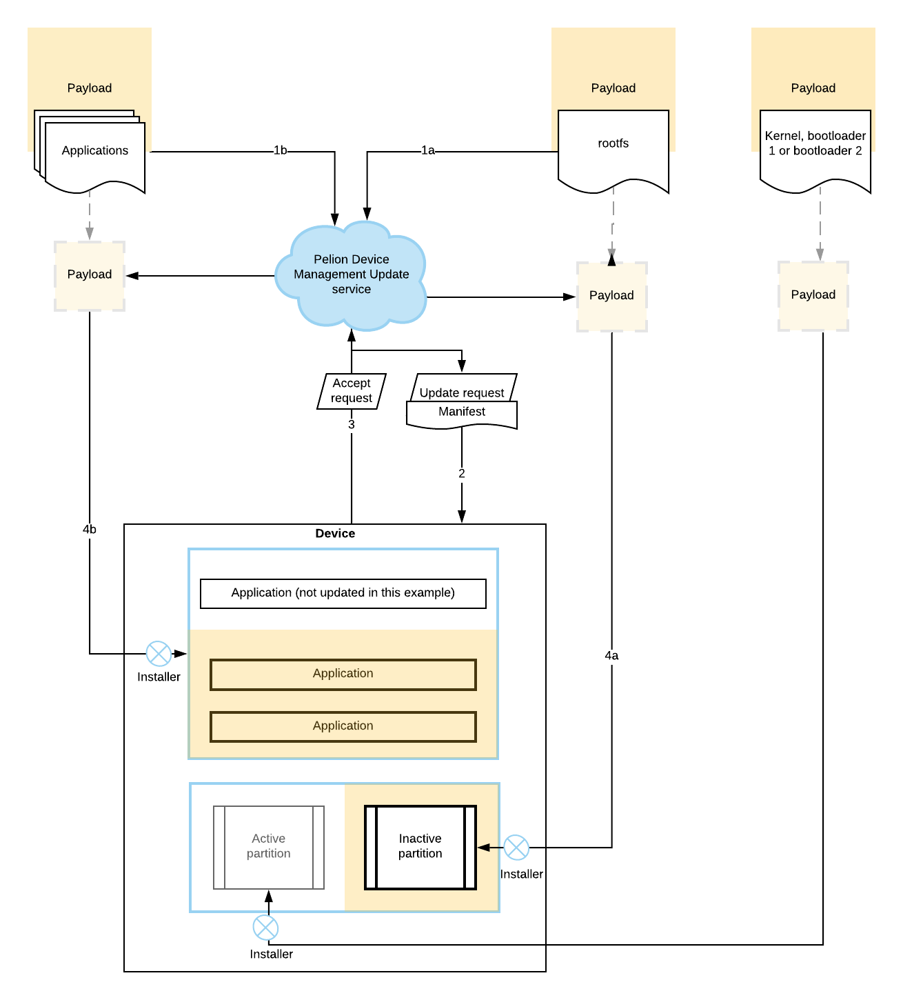

# Firmware updates in Mbed Linux OS

MBL uses Pelion Device Management to manage firmware updates, including **firmware over the air** (FOTA) update. MBL can perform a FOTA update of any application running on the device, as well as MBL OS components.

Update process

1. Use the `create-update-payload` tool to create a new version of your firmware with your Device Management account. This is your payload, and it is a `.tar` file that can contain either:

   * An application update: one or more OPKG packages (`.ipk` files), as explained in [Updating an application](../../update/updating_an_application.html).
   
   Or:
   
   * MBL OS components, as explained in [updating an MBL image](../update/updating-an-mbl-image.html), which can contain an updated version of one of:
      * A `rootfs` update: a compressed `tar` file that contains the root file system content.
      * A boot component update: either of the two boot component binaries. The first boot component usually contains the TF-A bootloader stage two (BL2). The second boot component usually contains the TF-A bootloader stage three (BL3), OP-TEE and U-boot.
      * A kernel update: a binary containing the Linux kernel image, the associated device tree blob, U-Boot boot script and initramfs.

   **Note**: Currently, MBL does **not** support updating multiple components in a single FOTA update. To update multiple components, you need to run multiple updates.

1. Start the update process by initiating an update campaign.
1. Device Management then sends the device an update request with a manifest detailing what needs to be updated.
1. If the device accepts the request, Device Management sends your payload file, which the manifest tool uploaded, to the device and monitors the update process.

**Tip:** Refer to the Pelion Device Management documentation for a [full review of the update process](https://www.pelion.com/docs/device-management/current/updating-firmware/index.html).

**Note:** MBL relies on Device Management to validate updates. For more information, [see the Security in firmware update section of the Device Management documentation](https://www.pelion.com/docs/device-management/latest/updating-firmware/security.html).

### Application updates

After receiving a payload file containing application updates, for each application update, MBL:

1. Installs the version of the application contained in the update payload and checks that this is successful.
1. Stops the version of the application already running on the system.
1. Runs the newly installed version of the application and checks that it starts successfully.
1. Removes the previously installed version of the application.

**Note:** If the update payload contains multiple applications, MBL removes the previously installed versions only if *all* applications successfully installed and ran. If any application in the update payload fails to install or run, MBL removes all newly installed application versions and restarts the previously installed versions.

### Root file system updates

To support `rootfs` updates, MBL devices have two root partitions:

* **Active**: a partition containing the root file system for the running system.
* **Inactive**: a partition available to receive a `rootfs` update payload.

After receiving a payload file containing a `rootfs` update, MBL:

1. Writes the contents of the root file system update payload to the inactive partition.
1. Flips a flag indicating which root file system partition is active. After a reboot, the previously inactive partition becomes the active one, and the active one becomes inactive.
1. Reboots the device.
1. Mounts the root file system from the update payload.

The previously active (now inactive) root file system partition is now ready to receive the next `rootfs` update.

### Boot and kernel components updates

**Note:** Currently, these components are updated in place, so they are not robust to power failures or file corruption. Future releases will address this.

After receiving a payload file containing a boot component or kernel update binary, MBL:

1. Overwrites the contents of the corresponding [partition](../references/partition-layout.html) containing the boot component or kernel.
1. Reboots the device.
