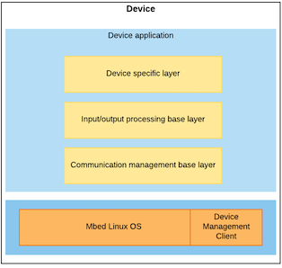

# Developing applications for Mbed Linux OS

When designing applications for IoT devices running Mbed Linux OS (MBL), keep in mind:

* The main goal is to give end users control of the IoT device running your application.
* **End user applications** (on a phone, control panel and so on) and MBL IoT **device applications** both communicate with a cloud service linked to a single Pelion Device Management account. They do not communicate directly with each other.
* For mass production, you may need to create an **installer device** that can configure our IoT devices with information that cannot be assumed at the factory stage, such as access to secure Wi-Fi networks.

Application design focuses on connecting the IoT device and the end user's device over an application cloud

## Designing modular applications

You're designing an application on an IoT device that must handle an internet connection, as well as any processing and automation it needs to be useful. You need some general functionality, like connectivity and input/output handling, for every single application you develop. Other functionality needs to match the requirements of the device-specific application. For example, security cameras need to handle video streams and motion sensor alerts, but there is no need for this functionality on other device classes, like heating systems.

You have three options:

* Create a single application that includes all the functionality you need - general and specific. This is simple, but may make your code less reusable because it is in a monolithic bundle that may not have clear interfaces between services, making them hard to separate.
* Use one of two modular approaches:
    * Create smaller applications that provide one microservice each, and install these applications together with a very lean device-specific application.
    * Create base layers that provide one functionality each, and use them together in all your applications. Each application adds its own device-specific layer to these base layers.

Multiple applications    
Application with multiple layers    

**An MBL IoT device can have multiple applications, and one or more of those applications can consist of multiple base layers**

## Handling application dependencies

Applications have dependencies, such as a runtime library or a language like Python. You can containerize an application with all of its dependencies, or rely on your Linux distribution to provide them. There's a tradeoff: the more you pack into the application container, the bigger it is. The advantage is that the application is independent of the distribution, so you can update the distribution without breaking the application with a mismatched dependency, or update the application without being forced to update the distribution at the same time.

## Connectivity

End user applications and MBL IoT device applications communicate with the same Device Management account and rely on the Device Management services provided to that account.

MBL contains the Pelion Device Management Client, which is used to connect to Pelion Device Management. Each device has only one instance of the client, which supports all applications running on that device. Your applications can include other cloud clients, but must not include Pelion Device Management Client.

Applications can communicate with Device Management Client over MBL's D-Bus API. This lets you use the [LwM2M communication protocol provided by Device Management](https://www.pelion.com/docs/device-management/latest/introduction/management-services-and-protocols.html).

**Note**: This functionality will be available in a future release of MBL.

## Installer devices

Installer devices configure deployed IoT devices that cannot be fully preconfigured. For example, so far you've been using your own Device Management account, but when you start producing devices for a market, you may not want to associate those devices with your own account. Instead, a company that bought a group of devices may want to associate them with its own account. To do that, they must be able to access the device's platform services, which handle common functions on behalf of applications, including the network manager and secure storage (to store keys and credentials). They do this with an installer device, which can be on their phone or PC, and can access the IoT device over BLE, USB cable and other local connections.

You don't need an installer device while developing your IoT application, but you do need to think about what your application may later require from the installer device.

***

Copyright © 2020 Arm Limited (or its affiliates)
