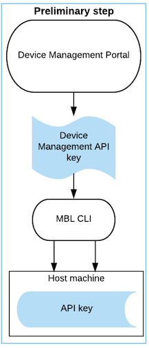
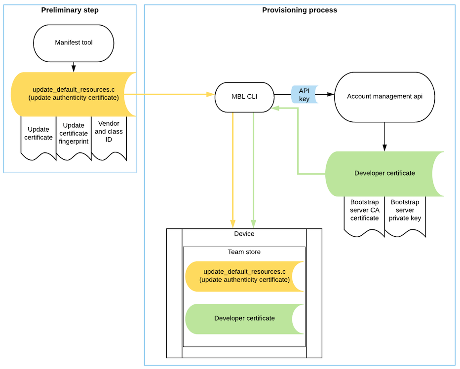

# Provisioning for Pelion Device Management

**Note**: This document assumes you already [have a device running MBL](../first-image/index.html) and a [Pelion Device Management account](https://os.mbed.com/account/login/).

To connect your devices to Pelion Device Management, you must provision the device with security credentials that establish trust with the cloud services. Device Management offers a **developer certificate** to connect a development device to a Device Management account. The developer certificate doesn't require setting up a certificate authority (unlike the full credentials for production devices). Instead, you can simply download the certificate from the Device Management Portal. You then need to get the certificate on the device in a process called **provisioning**.

To use Pelion Device Management for firmware updates of either your file system or your applications, you must also provision your device with an **update authenticity certificate**. This certificate is used to sign and verify [firmware update manifests](https://cloud.mbed.com/docs/latest/updating-firmware/firmware-manifests.html), and is created using the manifest tool.

Starting with Mbed Linux OS 0.6, your devices can be provisioned with developer and update authenticity certificates using MBL CLI 2.0.

**Tip**: See the Device Management documentation for [background on the developer certificate and its scope](https://cloud.mbed.com/docs/latest/connecting/provisioning-development-devices.html).

## Process review

**Tip**: If you want to specify a storage location on the device for your API key and certificates, rather than use the default storage location, [do so before you begin the provisioning process](../first-image/provisioning-your-device.html#optional-persistent-storage-locations).

The full provisioning process is:

1. Generate a Device Management API key from the **Device Management Portal**.

1. Use **MBL CLI** to save the API key to the host machine.

1. Use the **manifest tool** to generate the firmware update authenticity certificate (`update_default_resources.c`), which contains the:

    * Update certificate fingerprint.
    * Update certificate.
    * Vendor and class IDs.

1. Use **MBL CLI** to:

    1. Create a developer certificate. The developer certificate (`mbed_cloud_credentials.c`) contains:

        * The bootstrap server CA certificate.
        * The bootstrap server private key.
        * The bootstrap server information.

    1. Program the developer certificate and authenticity certificate to the device.

As a preliminary step, create an API key on the Device Management Portal and used MBL CLI to save it to the device.

As a preliminary step, create an update authenticity certificate with the manifest tool. Then use MBL CLI to create a developer certificate and program both the update authenticity and developer certificates on the device.
